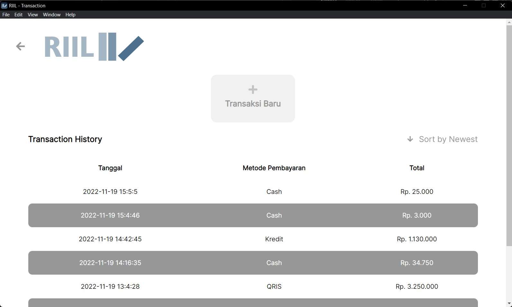
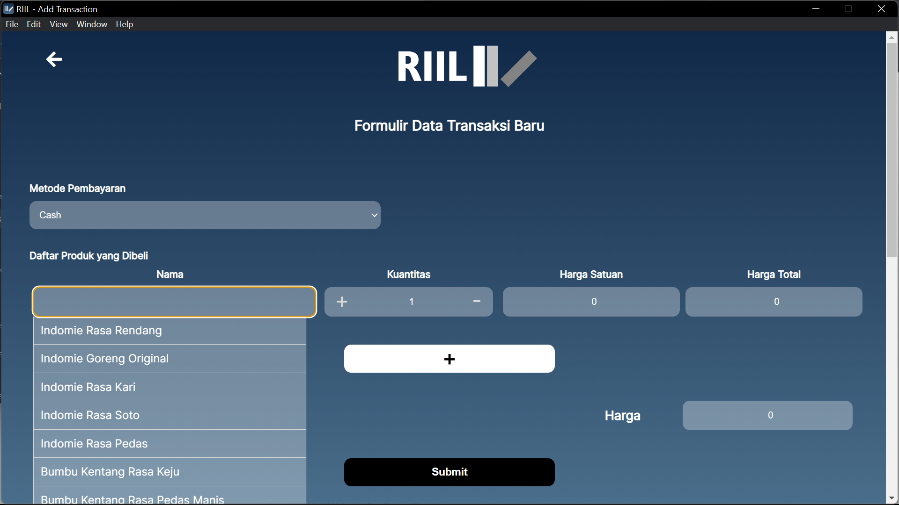
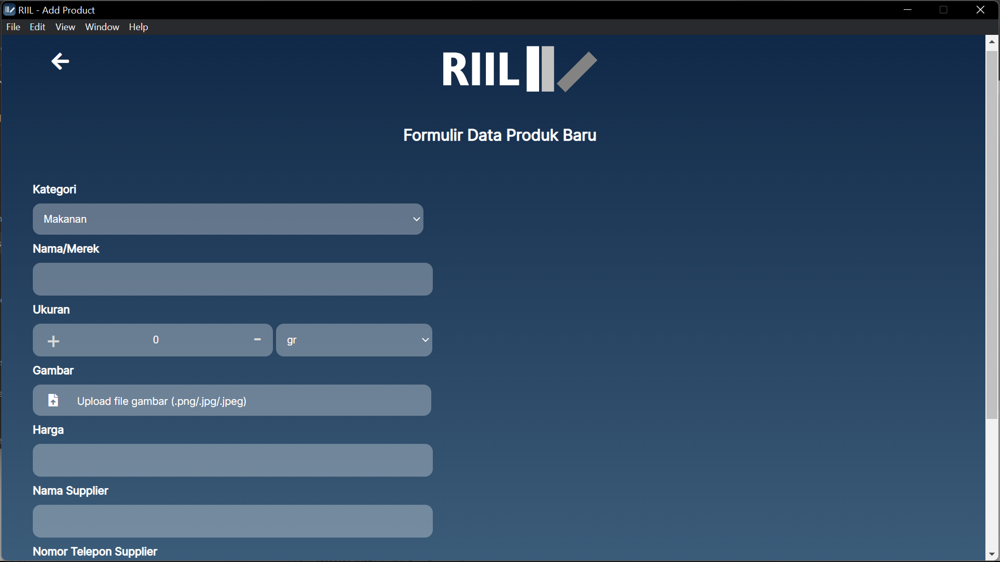
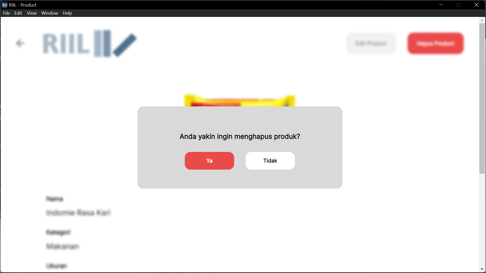
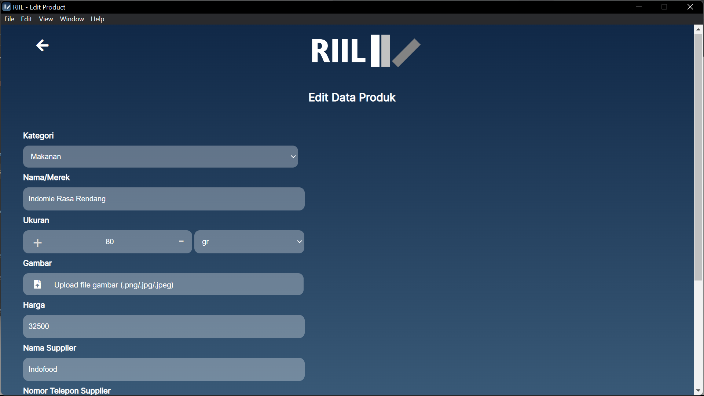
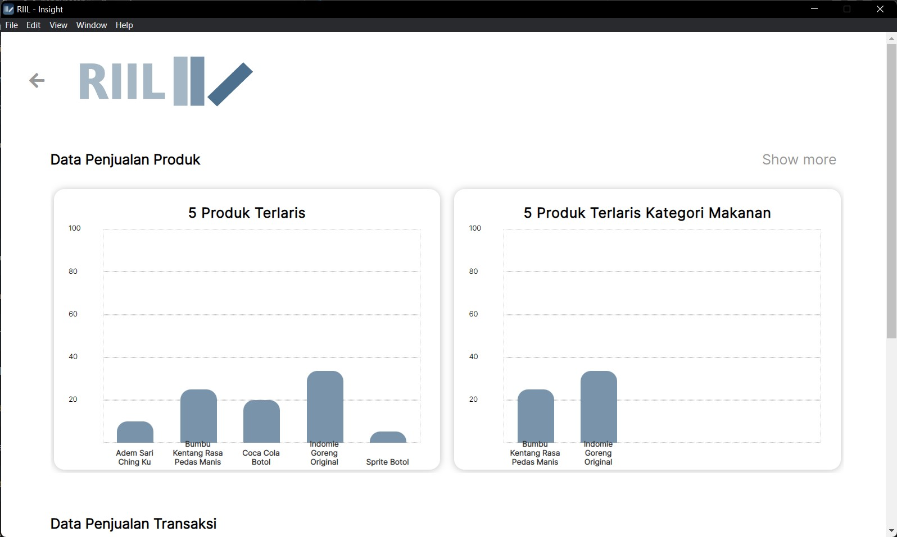
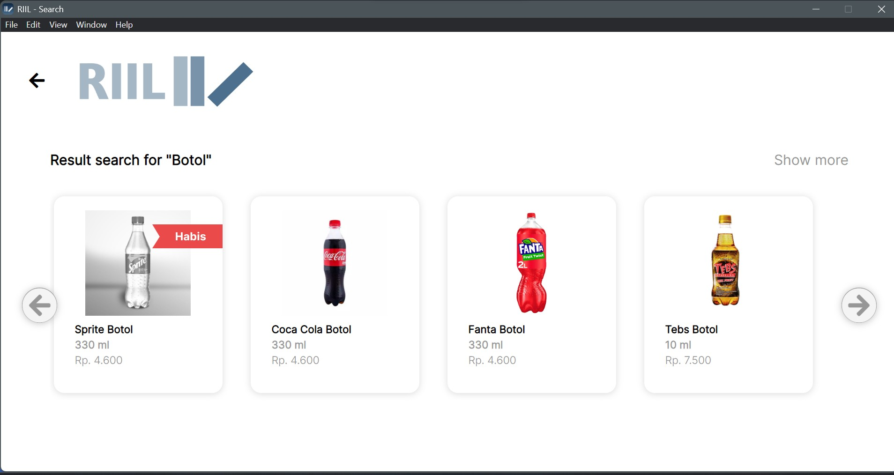

# Real-time Inventory Information Log
Real-time Inventory Information Log (RIIL) adalah sebuah aplikasi perangkat lunak pada desktop yang berfungsi untuk membantu penjaga toko kelontong untuk mengetahui informasi mengenai produk yang dijual serta melakukan pencatatan transaksi penjualan.

## Tech Stack

- [Electron](https://www.electronjs.org/docs/latest)
- [Python sqlite3](https://docs.python.org/3/library/sqlite3.html)
- [Python Flask](https://flask.palletsprojects.com/en/2.2.x/)

## Setup and Installation

1. Clone repository
```
git clone "https://github.com/riandyhasan/RIIL.git"
```
2. Install dependencies untuk nodejs
```
npm i
```
3. Buat virtual env Python
```
python -m venv env
```
4. Aktifkan virtual env python
```
./env/Scripts/activate
```
4. Aktifkan virtual env python(mac)
```
./env/bin
source activate
```
5. Install Python depedencies
```
pip3 install -r requirements.txt
```
6. Jalankan aplikasi
```
npm start
```

## Modules Implementation
| Modul  | Penanggung Jawab |
| ------------- | ------------- |
| Transaksi  | 18220024 - Aulia Fajriaturrakhmah |
| Produk Baru  | 18220030 - Shafira Putri Azmi Imani |
| Hapus Produk  | 18220058 - Riandy Hasan |
| Edit Produk  | 18220060 - Laksamana Vixell Tanjaya H. |
| Rekap Penjualan  | 18220058 - Riandy Hasan |
| Analisis Penjualan  | 18220058 - Riandy Hasan |
| Search Produk  | 18220016 - Salsabila Asyifa Shalehah |

1. Transaksi



2. Produk Baru

.jpg)

3. Hapus Produk


4. Edit Produk


5. Rekap Penjualan


6. Analisis Penjualan
.jpg)

7. Search Produk


## Database
### Table produk
| column  | attribute |
| ------------- | ------------- |
| id  | int |
| nama  | text |
| harga  | int |
| gambar  | text |
| kategori  | varchar(100) |
| nama_supplier  | text |
| no_telp_supplier  | int |
| kuantitas  | int |
| ukuran  | varchar(255) |

### Table riwayat_transaksi
| column  | attribute |
| ------------- | ------------- |
| id  | int |
| wakti  | datetime |
| total_pembayaran  | int |
| metode_pembayaran  | varchar(100) |

### Table item_transaksi
| column  | attribute |
| ------------- | ------------- |
| id  | int |
| produk  | int |
| transaksi  | int |
| kuantitas  | int |
| total_harga  | int |

## Branching
Setiap membuat branch baru harus ambil base dari `master`. Untuk penamaan branch mengikuti format berikut.
Format branch: `<name>/feature/<title>`

Contoh: vixell-keren/feature/add-product
Penamaan menggunakan kebab case

## Pull Request and Commit Messages
Dalam melakukan commit message mengikuti format berikut.
Format commit message: `<type>: <message>`

Untuk type mengikuti semantic berikut.
- `feature`: (menambahkan fitur baru)
- `fix`: (melakukan bug fix)
- `style`: (melakukan formatting pada code, tidak ada perubahan pada aplikasi)
- `refactor`: (melakukan refactor)
- `test`: (menambahkan test)
- `doc`: (menambahkan dokumentasi atau file assets)

Contoh: feature: menambahkan user interface pada halaman Login
        test: menambahkan test pada class Auth

Setiap merge request harus di-review oleh minimal 1 anggota (selain yang membuat merge request) dari kelompok tersebut. Setelah melakukan code review, berikan comment ataupun like sebagai bukti.
